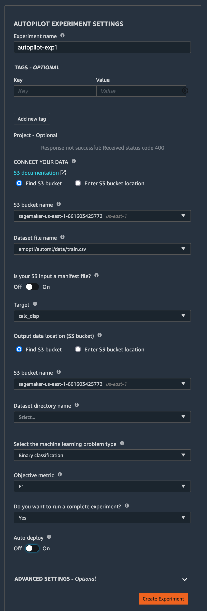

# Create an Autopilot job from SageMaker Studio

### Perform the following steps, noting the numbered boxes 1, 2, and 3 in the image below.
1. In SageMaker Studio, select the tab is noted
1. Select the drop down list and choose *Experiments and Trials*
1. Click *Create Experiment*

### Fill in the details of the Autopilot job

1. Specify a name for this Autopilot job
1. Specify the source of the training data (an S3 bucket, folder, and filename)
1. Specify the column which is the *label* to be predicted
1. Specify the S3 location where to place the results. A folder with the name of the Autopilot job will be created under this location
1. Specify the type of prediction to be done. In our example, it is *Binary Classification*
1. Specify the Objective (i.e., the metric) to be used to determine which model performs best. For Binary Classification, the F1 score is a good choice.
1. Disable *Auto Deploy* since we will manually run a *Batch Transform* agains the best performing model
1. Don't click *Create Experiment* just yet

### If you open the *Advanced Settings* you will see more configurations that can be set for this Autopilot job

### Now click *Create Experiment*
After the Autopilot job has started, you will see this following display indicating the progress of the job.  

By default, Autopilot will create 250 candidates. This quantity may be adjusted up or down.

Press the *Job Profile* tab and you will see all the parameters that were used when running this job.

